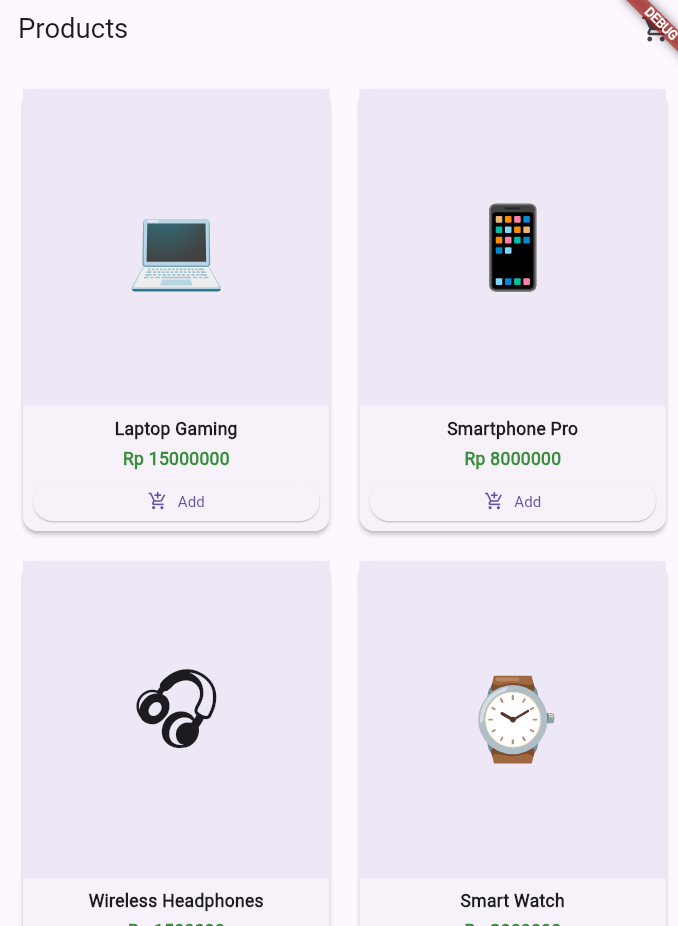
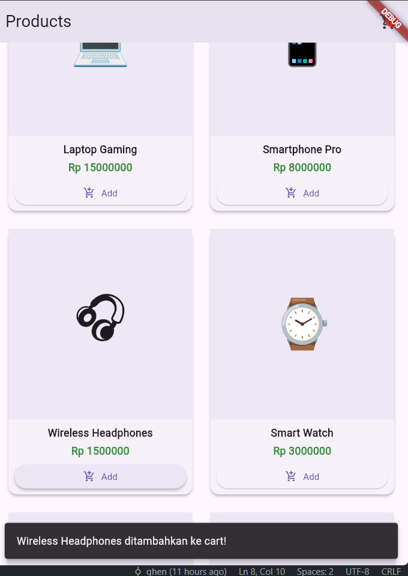
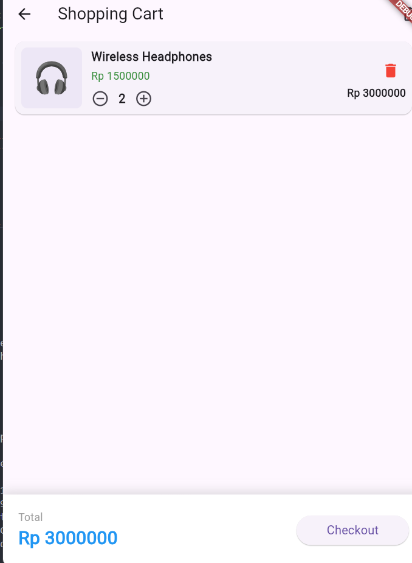
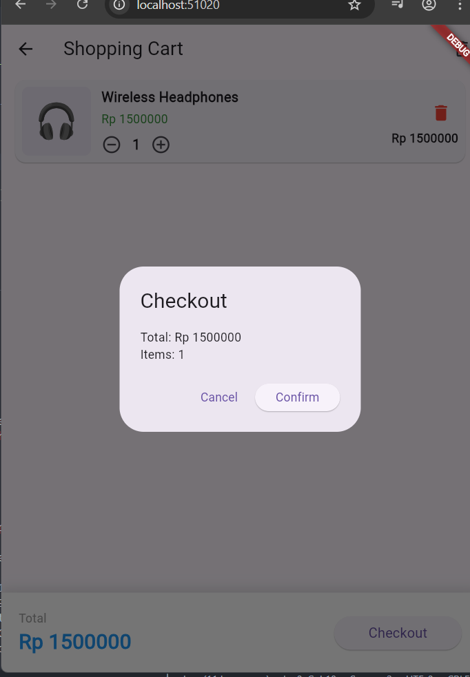

# Mini E-Commerce Shopping Cart 🛒

Proyek ini adalah aplikasi e-commerce sederhana yang dibangun menggunakan **Flutter** dan **Provider** untuk manajemen *state*. Aplikasi ini memungkinkan pengguna untuk melihat daftar produk, menambahkannya ke keranjang, dan mengelola item di dalam keranjang tersebut secara *real-time*.

## 🎯 Tujuan Proyek

Membangun sistem keranjang belanja mini yang fungsional dengan implementasi library Provider.

## ✅ Fitur Utama (Checklist)

Berdasarkan persyaratan tugas, aplikasi ini telah mengimplementasikan fitur-fitur berikut:

* **Product Model**: Mendefinisikan struktur data untuk setiap produk (ID, Nama, Harga, Emoji, Deskripsi).
* **Cart Model with ChangeNotifier**: Mengelola logika keranjang belanja dan memperbarui UI secara otomatis saat terjadi perubahan data.
* **Product List Page**: Halaman utama yang menampilkan katalog produk dalam tata letak grid.
* **Add to Cart Button**: Memungkinkan pengguna memasukkan produk pilihan ke dalam keranjang belanja.
* **Cart Badge**: Menampilkan jumlah item yang ada di keranjang pada ikon keranjang belanja di bagian atas layar.
* **Cart Page with All Items**: Halaman khusus untuk melihat daftar barang yang telah ditambahkan.
* **Increase/Decrease Quantity**: Kemampuan untuk menambah atau mengurangi jumlah item tertentu langsung dari halaman keranjang.
* **Remove Item Button**: Tombol untuk menghapus barang dari daftar belanja.
* **Total Price Calculation**: Sistem penghitungan otomatis untuk total biaya belanjaan.
* **Empty Cart Message**: Pesan informatif yang muncul ketika keranjang belanja dalam keadaan kosong.

## 🛠️ Teknologi & Library

* **Flutter SDK**: Framework utama.
* **Dart**: Bahasa pemrograman.
* **Provider Package**: Digunakan untuk *State Management*.

---

### 1. Halaman Katalog Produk (Product List Page)

Ini adalah tampilan utama saat aplikasi dijalankan.

* **Grid Layout**: Produk ditampilkan menggunakan `GridView` dengan dua kolom sehingga terlihat rapi dan efisien.
* **Informasi Produk**: Setiap kartu produk menampilkan **Emoji** sebagai representasi visual, **Nama Produk**, dan **Harga** dalam format Rupiah.
* **Tombol Add to Cart**: Di setiap kartu terdapat tombol **"Add"** dengan ikon keranjang belanja. Saat ditekan, sistem menjalankan fungsi `addItem` melalui Provider.
* **Feedback Visual (SnackBar)**: Setelah menambahkan produk, muncul notifikasi di bagian bawah layar berbunyi *"Product Name ditambahkan ke cart!"* sebagai konfirmasi bagi pengguna.
* **Cart Badge**: Pada pojok kanan atas `AppBar`, terdapat ikon keranjang belanja yang dilengkapi dengan lingkaran merah (badge) untuk menunjukkan jumlah item yang ada di keranjang secara *real-time*.

### 2. Halaman Keranjang Belanja (Cart Page)

Halaman ini menampilkan detail item yang dipilih sebelum diproses lebih lanjut.

* **Daftar Item**: Menampilkan daftar barang dalam bentuk `Card` yang mencakup gambar/emoji, nama, dan harga satuan.
* **Kontrol Kuantitas (Increase/Decrease)**: Terdapat tombol **minus (-)** dan **plus (+)** untuk menambah atau mengurangi jumlah barang secara langsung.
* **Tombol Hapus (Remove Item)**: Ikon **tempat sampah merah** disediakan untuk menghapus satu jenis produk secara permanen dari keranjang.
* **Perhitungan Subtotal & Total**: Di sebelah kanan setiap item, muncul subtotal (harga x jumlah), dan di bagian bawah layar terdapat **Total Price Calculation** yang menjumlahkan seluruh isi keranjang.
* **Pesan Keranjang Kosong**: Jika pengguna menghapus semua barang, aplikasi secara otomatis menampilkan pesan *"Your cart is empty"*.

### 3. Proses Checkout

Langkah terakhir untuk menyelesaikan belanjaan.

* **Dialog Konfirmasi**: Saat tombol "Checkout" ditekan, muncul kotak dialog yang merangkum **Total Harga** dan **Total Barang**.
* **Action Buttons**: Terdapat pilihan "Cancel" untuk kembali atau "Confirm" untuk menyelesaikan pesanan dan mengosongkan keranjang belanja.

### 4. Implementasi State Management (Provider)

Secara teknis (di balik layar), aplikasi ini memenuhi kriteria "Project Goal" dengan cara:

* Menggunakan **ChangeNotifierProvider** di `main.dart` untuk membungkus seluruh aplikasi agar data keranjang dapat diakses dari mana saja.
* Menggunakan **Consumer** pada widget-widget spesifik (seperti badge dan list keranjang) agar UI tersebut otomatis menggambar ulang dirinya sendiri hanya saat data produk berubah.

---

### Penjelasan Logika Utama:

Aplikasi ini menggunakan pola **ChangeNotifier** dari library Provider. Saat tombol "Add" ditekan pada `product_list_page.dart`, fungsi `addItem` di dalam `CartModel` akan dipanggil. Fungsi tersebut kemudian memicu `notifyListeners()`, yang memerintahkan semua widget terkait (seperti Badge jumlah barang dan Halaman Keranjang) untuk menggambar ulang tampilannya dengan data terbaru secara otomatis.